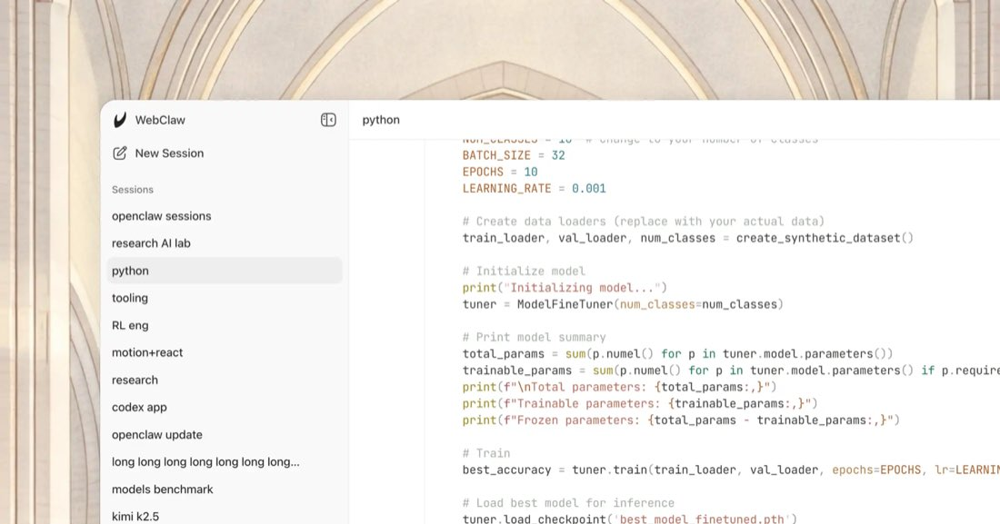

# CodexClaw



CodexClaw is a local web client for OpenAI Codex and Codex CLI sessions.

Status: public alpha, in progress. The current adapter runs local prompts through `codex exec --json`, stores lightweight session history in `.codex-claw`, and keeps the UI intentionally close to the original chat surface while the Codex-specific workflow matures.

## Installation

Clone and run locally:

```bash
git clone https://github.com/slashdevcorpse/codex-claw.git
cd codex-claw
pnpm install
pnpm dev
```

The app runs from `apps/codex-claw` and starts on port 3000 by default.

## CLI

The alpha CLI package lives in `packages/codex-claw`. During local development:

```bash
pnpm -C packages/codex-claw exec codex-claw --help
pnpm -C packages/codex-claw exec codex-claw doctor
```

After the first npm alpha publish, the install path will be:

```bash
npx codex-claw@alpha
```

## Configuration

CodexClaw reads these optional server-side values:

- `CODEX_CLI_COMMAND`: command used to launch Codex CLI, default `codex`.
- `CODEX_CLI_SANDBOX`: sandbox passed to Codex CLI, default `read-only`.
- `CODEX_CLI_WORKDIR`: workspace directory for Codex CLI runs, default app process cwd.
- `CODEX_CLAW_STATE_DIR`: directory for local session history, default `.codex-claw` under the app process cwd.

Copy `.env.example` to `apps/codex-claw/.env.local` when defaults are not enough.

## Alpha Scope

Working now:

- local React chat UI
- local session list, rename, delete, and history storage
- `codex exec --json` prompt execution
- CLI bootstrap and doctor checks

Known alpha limitations:

- Codex responses are appended when the CLI returns a completed assistant message; token-by-token streaming is not implemented yet.
- Image attachments are detected by the UI but are not passed through to Codex CLI yet.
- npm publishing is prepared but not completed.

## Contributing

Please read the [contributing guide](CONTRIBUTING.md).

## License

See [LICENSE](LICENSE).
